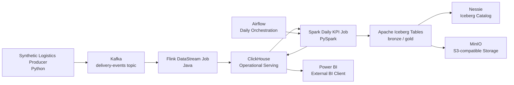
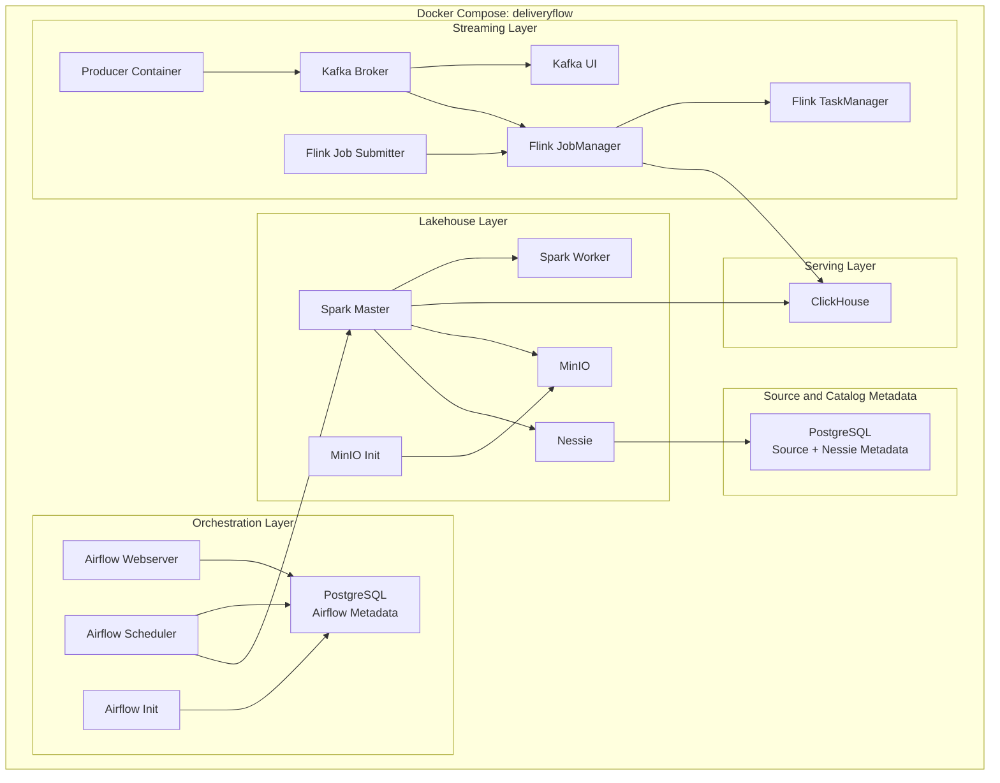
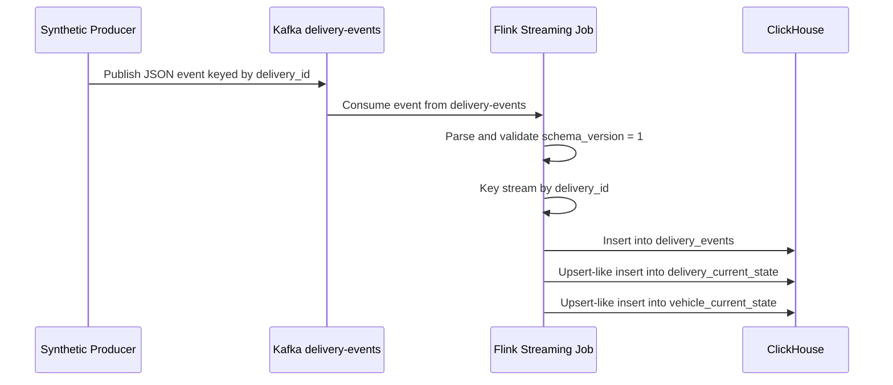
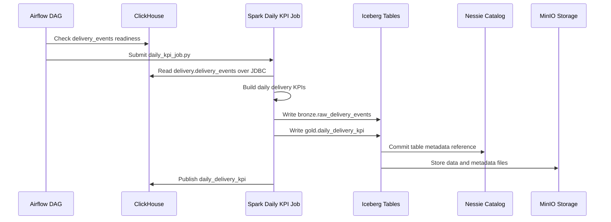

# DeliveryFlow Local Data Platform

DeliveryFlow is a local Docker Compose data platform for real-time delivery monitoring and daily transportation analytics. It demonstrates a practical logistics data engineering architecture with streaming ingestion, real-time operational serving, lakehouse storage, daily batch processing, orchestration, and BI-ready outputs.

The project is designed for local development and learning, while still applying production-oriented data engineering principles such as versioned event contracts, service health checks, isolated metadata databases, replayable storage, explicit orchestration, and pinned infrastructure versions.

## What This Project Does

DeliveryFlow models a transportation company that needs to monitor active deliveries and analyze daily delivery performance.

The platform supports these core workflows:

- Generate synthetic logistics events.
- Publish versioned JSON delivery events to Kafka.
- Process delivery events with Flink in near real time.
- Store operational history and current state in ClickHouse.
- Run daily KPI processing with Spark.
- Write analytical tables to Apache Iceberg through Nessie.
- Store Iceberg data and metadata files in MinIO.
- Publish BI-facing KPI output back to ClickHouse.
- Orchestrate daily Spark processing through Airflow.

## Architecture Diagram



Airflow is not part of the streaming path. Its responsibility is orchestration for scheduled batch workflows, especially the daily Spark KPI job.

## Runtime Service Map



## Data Flow

### Streaming Flow



### Batch Flow



## Technology Stack

- **Docker Compose** starts and wires the full local platform.
- **Apache Kafka** transports versioned JSON logistics events.
- **Kafka UI** provides a browser interface for local Kafka topics.
- **Apache Flink** processes streaming events and writes operational state.
- **ClickHouse** stores event history, current state, and BI-facing KPI tables.
- **Apache Spark** performs batch computation with PySpark application files.
- **Apache Iceberg** provides analytical table format semantics.
- **Nessie** acts as the Iceberg catalog.
- **MinIO** provides S3-compatible local object storage.
- **PostgreSQL** stores Airflow metadata and Nessie/source metadata.
- **Apache Airflow** orchestrates scheduled batch workflows.
- **Power BI** connects externally to ClickHouse for reporting.

## Repository Structure

```text
.
|-- configs/
|   `-- spark/
|       `-- spark-defaults.conf
|-- dags/
|   `-- delivery_daily_kpi.py
|-- docs/
|   |-- architecture-decisions.md
|   `-- power-bi.md
|-- scripts/
|   |-- e2e_smoke_test.py
|   `-- health_check.py
|-- services/
|   |-- airflow/
|   |-- clickhouse/
|   |-- flink/
|   |-- kafka/
|   |-- postgres/
|   `-- spark/
|-- src/
|   |-- contracts/
|   |   `-- delivery_event_v1.schema.json
|   |-- etl/
|   |   `-- apps/
|   |       |-- daily_kpi_job.py
|   |       `-- iceberg_smoke_test.py
|   `-- producers/
|       `-- synthetic_logistics_producer.py
|-- tests/
|   `-- test_event_contract.py
|-- docker-compose.yml
|-- Makefile
|-- README.md
|-- requirement.md
`-- plan.md
```

## Key Components

### Event Producer

`src/producers/synthetic_logistics_producer.py` generates synthetic delivery events and publishes them to Kafka.

Each event includes fields such as:

- `schema_version`
- `event_id`
- `event_type`
- `event_timestamp`
- `delivery_id`
- `vehicle_id`
- `driver_id`
- `warehouse_id`
- `route_id`
- `payload.status`
- `payload.latitude`
- `payload.longitude`
- `payload.delay_minutes`
- `payload.capacity_used`
- `payload.capacity_total`

Initial event types:

- `ORDER_LOADED`
- `VEHICLE_DEPARTED`
- `IN_TRANSIT`
- `DELIVERY_DELAYED`
- `DELIVERED`

### Event Contract

The versioned JSON contract is defined in:

```text
src/contracts/delivery_event_v1.schema.json
```

The current test suite checks that generated synthetic events follow the main expectations of this contract.

### Flink Streaming Job

The Flink job lives under:

```text
services/flink/src/main/java/local/deliveryflow/
```

Main responsibilities:

- Read from Kafka topic `delivery-events`.
- Parse JSON delivery events.
- Validate required version 1 fields.
- Key the stream by `delivery_id`.
- Write event history and current-state records to ClickHouse.

The job enables checkpointing with `AT_LEAST_ONCE` semantics. The local ClickHouse sink uses simple HTTP inserts, which is appropriate for the current bootstrap scope.

### ClickHouse Tables

ClickHouse initialization is defined in:

```text
services/clickhouse/init/001_delivery_schema.sql
```

Main tables:

- `delivery.delivery_events` stores event history.
- `delivery.delivery_current_state` stores the latest delivery state.
- `delivery.vehicle_current_state` stores the latest vehicle state.
- `delivery.daily_delivery_kpi` stores BI-facing daily KPI output.

### Spark Batch Jobs

Spark application files live in:

```text
src/etl/apps/
```

Current jobs:

- `iceberg_smoke_test.py` validates Spark -> Nessie -> Iceberg -> MinIO connectivity.
- `daily_kpi_job.py` reads delivery events from ClickHouse, computes daily KPIs, writes Iceberg tables, and publishes KPI output to ClickHouse.

The daily KPI job calculates:

- completed deliveries
- delayed deliveries
- on-time deliveries
- delay rate
- on-time rate
- average delay minutes
- average vehicle utilization

### Airflow DAG

The Airflow DAG is defined in:

```text
dags/delivery_daily_kpi.py
```

It contains two tasks:

1. `check_source_readiness` checks whether `delivery_events` has data.
2. `run_spark_daily_batch` submits the Spark daily KPI job.

The DAG is scheduled with `@daily` and uses `catchup=False`.

## Quick Start

### Prerequisites

Install or enable:

- Docker Desktop
- Docker Compose v2
- `make`
- Enough local RAM and disk for multiple data services

### Configure Environment

Copy the example environment file:

```powershell
Copy-Item .env.example .env
```

The checked-in `.env.example` contains local development values only. Do not commit production credentials.

### Start the Platform

Validate Compose configuration:

```powershell
make config
```

Start the local platform:

```powershell
make up
```

### Check Service Health

```powershell
make health
```

This runs non-destructive readiness checks for Kafka, PostgreSQL, MinIO, Nessie, Spark, ClickHouse, Flink, and Airflow.

### Show Local Endpoints

```powershell
make console
```

Common local URLs:

```text
Kafka UI:      http://localhost:8083
Flink UI:      http://localhost:8081
Spark UI:      http://localhost:8082
Airflow UI:    http://localhost:8080
ClickHouse:    http://localhost:8123
Nessie API:    http://localhost:19120/api/v2
MinIO API:     http://localhost:9000
MinIO Console: http://localhost:9001
```

The default local Airflow login in `.env.example` is `admin/admin`.

## Main Workflows

### Run the Streaming Pipeline

Submit the Flink job:

```powershell
make submit-flink-job
```

Produce synthetic delivery events:

```powershell
make produce
```

Expected result:

- Kafka receives events in the `delivery-events` topic.
- Flink consumes and processes those events.
- ClickHouse receives rows in `delivery_events`, `delivery_current_state`, and `vehicle_current_state`.

### Validate Iceberg Connectivity

```powershell
make spark-iceberg-test
```

Expected success marker:

```text
ICEBERG_SMOKE_TEST_OK
```

### Run Daily KPI Processing

After delivery events exist in ClickHouse:

```powershell
make spark-daily-kpi
```

Expected result:

- Iceberg bronze and gold tables are created or refreshed.
- ClickHouse receives KPI rows in `daily_delivery_kpi`.
- The job prints `DAILY_KPI_JOB_OK`.

### Run End-to-End Smoke Test

```powershell
make test-e2e
```

This produces events, waits for ClickHouse rows, and verifies that the streaming path is working.

## Make Commands

```text
make help                Show available commands
make config              Validate Docker Compose configuration
make build               Build local Airflow, Flink, Spark, and producer images
make pull                Pull pinned upstream images
make up                  Start the full local platform
make down                Stop containers and preserve named volumes
make clean               Remove project containers and orphans, preserving named volumes
make restart             Restart containers
make ps                  Show container status
make health              Run readiness checks
make console             Print service endpoints
make urls                Print browser URLs
make submit-flink-job    Submit the Flink streaming job
make produce             Generate synthetic delivery events
make spark-iceberg-test  Validate Spark/Nessie/Iceberg/MinIO
make spark-daily-kpi     Run daily KPI Spark processing
make airflow-dag-list    List Airflow DAGs
make test-e2e            Run local end-to-end smoke test
```

Log commands:

```text
make logs
make logs-kafka
make logs-kafka-ui
make logs-flink
make logs-spark
make logs-airflow
make logs-clickhouse
make logs-postgres
make logs-storage
make logs-nessie
```

## Configuration

Configuration is loaded from `.env`. The example file provides local-only development values.

Important ports:

- `KAFKA_HOST_PORT=9092`
- `KAFKA_UI_PORT=8083`
- `FLINK_UI_PORT=8081`
- `SPARK_MASTER_UI_PORT=8082`
- `AIRFLOW_WEB_PORT=8080`
- `CLICKHOUSE_HTTP_PORT=8123`
- `CLICKHOUSE_NATIVE_PORT=9009`
- `NESSIE_PORT=19120`
- `MINIO_API_PORT=9000`
- `MINIO_CONSOLE_PORT=9001`

If a port is already used on the host machine, change the corresponding value in `.env`.

## Tests

Run Python tests:

```powershell
pytest tests
```

The current test verifies that the synthetic producer creates events matching the main expectations of the versioned delivery event contract.

## Power BI

Power BI is not containerized. It connects from the host machine to ClickHouse.

Connection details:

```text
HTTP endpoint:   http://localhost:8123
Native endpoint: localhost:9009
Database:        delivery
```

Recommended reporting tables:

- `delivery_events`
- `delivery_current_state`
- `vehicle_current_state`
- `daily_delivery_kpi`

See `docs/power-bi.md` for additional BI notes.

## Stop the Platform

```powershell
make down
```

This stops containers and preserves named volumes. Kafka, PostgreSQL, MinIO, ClickHouse, Spark work data, and Airflow logs are not deleted by this command.

## Important Notes

- This project is intended for local development and learning.
- `.env` is ignored by git and must not contain production secrets.
- `make down` preserves named volumes.
- The default Makefile intentionally does not provide a volume-deleting reset target.
- Flink owns real-time processing.
- Spark owns batch analytics.
- Airflow owns batch orchestration.
- ClickHouse is the operational and BI-facing serving layer.
- MinIO stores Iceberg data and metadata files.
- Nessie is the Iceberg catalog, not the data lake itself.

## Additional Documentation

- `requirement.md` contains the broad business, architecture, and engineering specification.
- `plan.md` contains the project plan.
- `docs/architecture-decisions.md` records important technical decisions and pinned versions.
- `docs/power-bi.md` contains Power BI connection and reporting notes.
