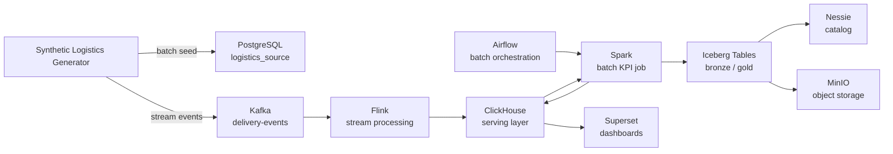
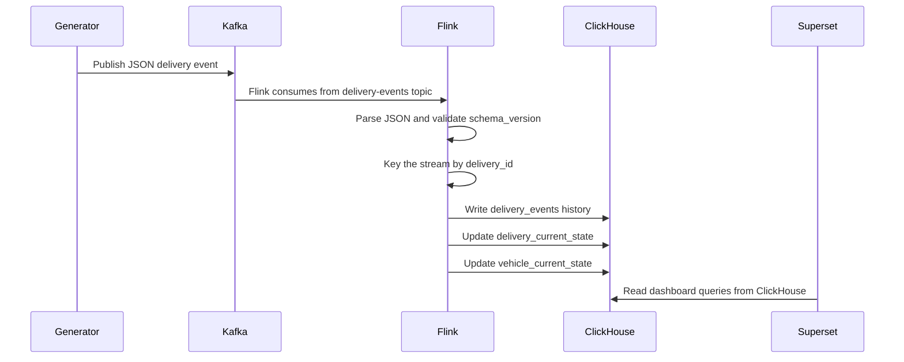
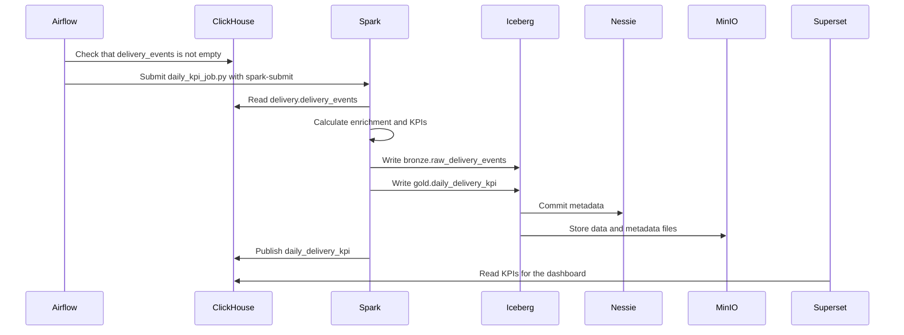
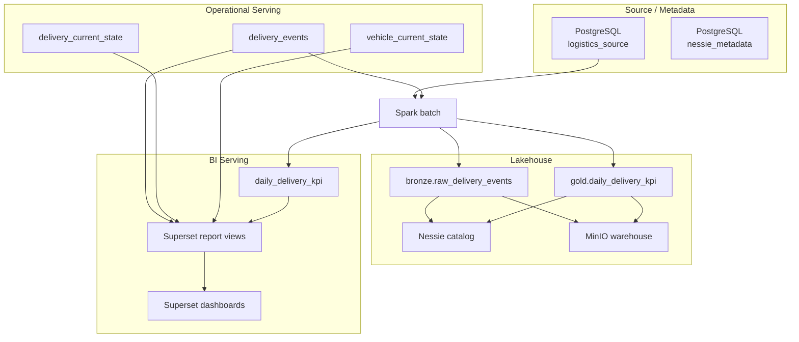

# DeliveryFlow Application Workflow

## Multi-Application Workflow Update

DeliveryFlow now contains two stream applications. The original delivery application remains the default path, and the fleet vehicle telemetry application is selected explicitly with `APP=fleet`.

Delivery operations:

```text
Synthetic producer -> Kafka delivery-events -> DeliveryStreamingJob -> ClickHouse delivery.* -> Superset
```

Fleet telemetry:

```text
Synthetic producer APP=fleet -> Kafka vehicle-telemetry-events -> VehicleTelemetrySqlJob -> ClickHouse fleet.*
```

Fleet telemetry is implemented with Java + Flink SQL/Table API so the repository demonstrates a second streaming style without changing the existing Java DataStream delivery job. The job writes raw telemetry, current vehicle state, health alerts, and five-minute metrics into the `fleet` ClickHouse database.

Fleet commands:

```powershell
make submit-flink-job APP=fleet
make produce APP=fleet
make test-e2e APP=fleet
```

Fleet ownership files:

- `configs/applications/fleet.yaml`
- `configs/datasets/fleet/vehicle_telemetry.yaml`
- `src/contracts/fleet/vehicle_telemetry_v1.schema.json`
- `services/flink/src/main/java/local/deliveryflow/VehicleTelemetrySqlJob.java`

This document explains step by step how applications, services, and batch and stream processes work in DeliveryFlow. It does more than list the services: it shows where data originates, which services process it, where it is stored, and how it appears as a report in Superset.

## Overall Logic

DeliveryFlow is a logistics data platform built on local Docker Compose. It represents the same business domain through two data flows:

- **Stream processing**: real-time delivery events move from Kafka to Flink and then to ClickHouse.
- **Batch processing**: source and serving data are read by Spark, written to the Iceberg/Nessie/MinIO layer, and the KPI results are published back to ClickHouse.



## One Generator Application

Generator file:

```text
src/producers/synthetic_logistics_producer.py
```

The entrypoint contains only workflow orchestration and backward-compatible imports. The producer implementation is split into modules by responsibility:

```text
src/producers/config.py       -> environment configuration and validation
src/producers/events.py       -> Delivery and Fleet event builders
src/producers/source.py       -> PostgreSQL batch/source seed
src/producers/streaming.py    -> Kafka transport and continuous pacing
```

This application produces two data types:

- Batch/source data for PostgreSQL.
- Stream delivery events for Kafka.

Select the mode with `PRODUCER_MODE`:

- `stream`: publishes only Kafka events.
- `batch`: seeds only the PostgreSQL source tables.
- `both`: seeds PostgreSQL first, then publishes Kafka events.

Default local mode:

```text
PRODUCER_MODE=both
```

### Runtime Image Ownership

The generator source remains the single application entrypoint, but container ownership is split across two images:

```text
services/producer/Dockerfile
    -> producer and producer-continuous
    -> event generation and PostgreSQL seed runtime only

services/tooling/Dockerfile
    -> platform-tools and superset-importer
    -> health, E2E, and BI-as-Code import tooling
```

`make produce` and `make produce APP=fleet` use the minimal producer image. `make health`, `make test-e2e`, and `make import-superset-assets` run from the one-shot tooling image. Command names and generator behavior remain unchanged.

The events generated by the application simulate different stages of the logistics process:

- `ORDER_LOADED`
- `VEHICLE_DEPARTED`
- `IN_TRANSIT`
- `DELIVERY_DELAYED`
- `DELIVERED`

The event payload now contains more than status and coordinates. It includes richer fields for reporting:

- `service_level`
- `priority`
- `customer_id`
- `destination_city`
- `package_count`
- `order_value`
- `payment_method`
- `planned_distance_km`
- `traffic_condition`
- `weather_condition`

### Continuous Stream Mode

The stream generator can run as a continuous service instead of stopping after one run. The `producer-continuous` service starts with `PRODUCER_MODE=stream` and `PRODUCER_CONTINUOUS=true`.

Default rate:

```text
PRODUCER_CONTINUOUS_INTERVAL_SECONDS=60
PRODUCER_EVENTS_PER_INTERVAL=10
```

This publishes a batch of 10 events to the Kafka `delivery-events` topic every 60 seconds. The batch-of-10 approach keeps rate tests simple, while monotonic-deadline pacing prevents event serialization and Kafka flush time from accumulating into the next interval. This mode is useful for verifying that event volume, latest delivery state, and vehicle utilization charts update over time in Superset.

Start the continuous producer manually:

```powershell
make produce-continuous
```

Log-lara baxmaq:
View the logs:

```powershell
make logs-producer-continuous
```

Stop the continuous producer:

```powershell
make stop-continuous-producer
```

## Stream Pipeline

The stream pipeline provides real-time monitoring.

```text
Generator -> Kafka -> Flink -> ClickHouse -> Superset
```



### Kafka Rolu
### Kafka Role

Kafka is the domain event transport layer. The primary topic in this project is:
**Purpose:**
Kafka is the distributed event transport layer for all asynchronous domain messages.

```text
delivery-events
```
**Why it exists:**
It decouples event generators from stream processing consumers and buffers incoming real-time traffic reliably.

Events are published with `delivery_id` as the key. This keeps event ordering for the same delivery more stable in the local lab.
**Input:**
Raw JSON event payloads published by the synthetic producer.

### Flink Rolu
**Output:**
Partitioned, ordered event streams consumed by downstream Flink jobs.

Flink performs real-time processing. The primary job is:
**Consumer:**
Flink streaming applications (`DeliveryStreamingJob` and `VehicleTelemetrySqlJob`).

```text
services/flink/src/main/java/local/deliveryflow/DeliveryStreamingJob.java
```
**Example:**
The `delivery-events` topic carries delivery lifecycle events keyed by `delivery_id`.
The `vehicle-telemetry-events` topic carries telemetry metrics keyed by `vehicle_id`.

The Flink job is responsible for:
### Flink Role

- Reading events from Kafka.
- Parsing the JSON payload with `DeliveryEventParser`.
- Accepting events with `schema_version = 1`.
- Keying events by `delivery_id`.
- Writing history and latest state to ClickHouse.
**Purpose:**
Flink performs stateful, low-latency stream processing and operational projections.

Flink sink:
**Why it exists:**
It provides sub-second transformations, event-time windowing, schema validation, and writes current-state snapshots directly into the serving layer.

```text
services/flink/src/main/java/local/deliveryflow/ClickHouseDeliverySink.java
```
**Input:**
Versioned JSON events from Kafka topics (`delivery-events` and `vehicle-telemetry-events`).

This sink writes to three tables:
**Output:**
Validated operational state records and immutable event records written via HTTP JSONEachRow into ClickHouse.

- `delivery.delivery_events`
- `delivery.delivery_current_state`
- `delivery.vehicle_current_state`
**Consumer:**
ClickHouse operational serving tables (`delivery.*` and `fleet.*`), which are subsequently read by Apache Superset dashboards.

**Primary Jobs:**
- `DeliveryStreamingJob.java`: Java DataStream API pipeline for the Delivery application.
- `VehicleTelemetrySqlJob.java`: Java Flink SQL/Table API pipeline for the Fleet application.

**Sink:**
`ClickHouseDeliverySink.java` writes to three delivery serving tables:
- `delivery.delivery_events` (immutable audit history)
- `delivery.delivery_current_state` (latest state per delivery)
- `delivery.vehicle_current_state` (latest state per vehicle)

## Batch Pipeline

The batch pipeline provides daily analytics and lakehouse writes.
The batch pipeline provides daily analytics, lakehouse storage, and historical reporting.

```text
ClickHouse -> Spark -> Iceberg/Nessie/MinIO -> ClickHouse -> Superset
```



### Spark Rolu
### Spark Role

Spark is the batch computation engine. The primary job is:
**Purpose:**
Spark is the distributed batch computation engine for heavy historical aggregations and Lakehouse management.

```text
src/etl/apps/daily_kpi_job.py
```
**Why it exists:**
It handles large-scale data transformation, analytical KPI computation, and Iceberg bronze/gold table management with ACID guarantees.

The Spark job reads delivery event history from ClickHouse and calculates these metrics:
**Input:**
Event history from ClickHouse `delivery.delivery_events` and relational source data from PostgreSQL `logistics_source`.

**Output:**
- Analytical Parquet files committed to Iceberg tables via Nessie catalog.
- Aggregated daily KPI rows published to ClickHouse `delivery.daily_delivery_kpi`.

**Consumer:**
- Long-term analytics queries running against Iceberg.
- Superset daily KPI charts querying ClickHouse.

**Primary Job:**
`src/etl/apps/daily_kpi_job.py` calculates key operational metrics:
- completed deliveries
- delayed deliveries
- on-time deliveries
- delay rate
- on-time rate
- delay rate and on-time rate
- average delay minutes
- average vehicle utilization
- total order value
- total package count
- total order value and package count
- average distance km

Spark writes results to two destinations:
- Iceberg analytical tables: long-term lakehouse storage.
- ClickHouse KPI table: fast serving for Superset.

### Airflow Role

- Iceberg analytical tables: long-term lakehouse storage.
- ClickHouse KPI table: fast serving for Superset.
**Purpose:**
Airflow acts as the batch orchestration control plane and workflow scheduler.

### Airflow Rolu
**Why it exists:**
It provides dependable task scheduling, SLA tracking, readiness verification, and dependency management for batch pipelines.
It provides dependable task scheduling, SLA tracking, readiness verification, and dependency management for batch pipelines. Airflow is not part of the streaming path.

Airflow is not part of the streaming path. Its role is to schedule and monitor the batch workflow.
**Input:**
Scheduled triggers (daily cron intervals or manual operator runs).

DAG file:
**Output:**
Triggered container commands (`spark-submit` execution) and execution status logs.

```text
dags/delivery_daily_kpi.py
```
**Consumer:**
Platform operators and monitoring systems.

DAG tasks:
**Primary DAG:**
`dags/delivery_daily_kpi.py` defines two sequenced tasks:
1. `check_source_readiness`: verifies that ClickHouse contains `delivery_events` data before triggering Spark.
2. `run_spark_daily_batch`: triggers the Spark daily KPI job inside the Spark master container.

1. `check_source_readiness`: verifies that ClickHouse contains `delivery_events` data.
2. `run_spark_daily_batch`: submits the Spark daily KPI job.

## Storage and Serving Layers



## Main Workflows

### Start the Platform

```powershell
make up
```

This command builds and starts the Docker Compose services.

### Submit the Stream Job

```powershell
make submit-flink-job
```

This command submits the Flink job to the JobManager.

### Generate Data

Batch and stream together:

```powershell
make produce
```

Stream only:

```powershell
make produce-stream
```

PostgreSQL batch source only:

```powershell
make seed-batch-source
```

### Run the Batch KPI Job

```powershell
make spark-daily-kpi
```

This command runs the Spark job and writes KPI results to both Iceberg and ClickHouse.

## Where to Look

Service UIs:

- Kafka UI: `http://localhost:8083`
- Flink UI: `http://localhost:8081`
- Spark UI: `http://localhost:8082`
- Airflow UI: `http://localhost:8080`
- Superset UI: `http://localhost:8088`
- Superset BI-as-code import:

```powershell
make import-superset-assets
```

This import creates or updates the database connection, five datasets, five charts, and the `DeliveryFlow Operations Dashboard` from `configs/superset/deliveryflow_bi.yaml`. The importer converts chart metrics to Superset adhoc metric format and writes `event_hour` datetime-axis metadata for the timeseries chart.
- MinIO Console: `http://localhost:9001`

Database inspection:

```powershell
docker compose exec postgres-source psql -U postgres -d logistics_source -c "\dt"
docker compose exec clickhouse clickhouse-client --query "SHOW TABLES FROM delivery"
```

## Key Principles

- Kafka provides event transport, not the analytical source of truth.
- Flink writes real-time state and operational history.
- Spark performs batch aggregation and lakehouse writes.
- Iceberg/Nessie/MinIO provide long-term analytical storage.
- ClickHouse is the serving layer.
- Superset is the dashboard layer.
- Airflow is the batch orchestration layer.
