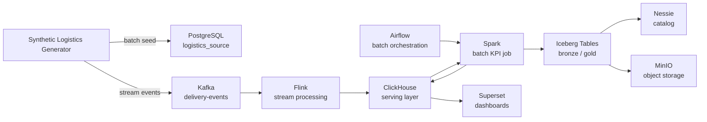
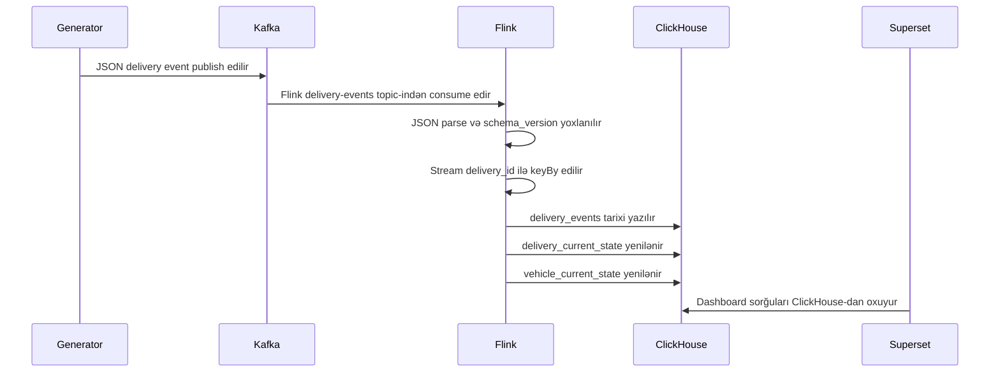
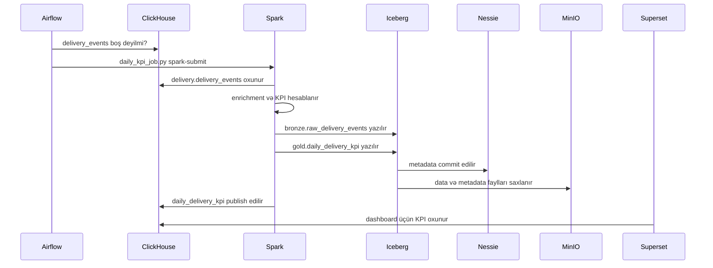
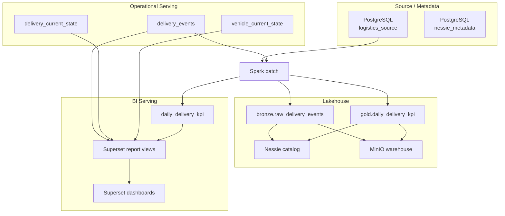

# DeliveryFlow Application Workflow

## Multi-Application Workflow Update

DeliveryFlow now contains two stream applications. The original delivery application remains the default path, and the fleet vehicle telemetry application is selected explicitly with `APP=fleet`.

Delivery operations:

```text
Synthetic producer -> Kafka delivery-events -> DeliveryStreamingJob -> ClickHouse delivery.* -> Superset
```

Fleet telemetry:

```text
Synthetic producer APP=fleet -> Kafka vehicle-telemetry-events -> VehicleTelemetrySqlJob -> ClickHouse fleet.*
```

Fleet telemetry is implemented with Java + Flink SQL/Table API so the repository demonstrates a second streaming style without changing the existing Java DataStream delivery job. The job writes raw telemetry, current vehicle state, health alerts, and five-minute metrics into the `fleet` ClickHouse database.

Fleet commands:

```powershell
make submit-flink-job APP=fleet
make produce APP=fleet
make test-e2e APP=fleet
```

Fleet ownership files:

- `configs/applications/fleet.yaml`
- `configs/datasets/fleet/vehicle_telemetry.yaml`
- `src/contracts/fleet/vehicle_telemetry_v1.schema.json`
- `services/flink/src/main/java/local/deliveryflow/VehicleTelemetrySqlJob.java`

Bu sənəd DeliveryFlow layihəsində tətbiqlərin, servislərin, batch və stream proseslərinin necə işlədiyini addım-addım izah edir. Məqsəd yalnız "hansı servis var" sualına cavab vermək deyil; məqsəd data-nın hansı mənbədən çıxdığını, hansı servisdən keçdiyini, harada saxlandığını və Superset-də necə hesabat kimi göründüyünü aydın göstərməkdir.

## Ümumi Məntiq

DeliveryFlow lokal Docker Compose üzərində qurulmuş logistika data platformasıdır. Platforma eyni biznes domenini iki fərqli data axını ilə göstərir:

- **Stream processing**: real-time delivery event-ləri Kafka-dan Flink-ə, oradan ClickHouse-a gedir.
- **Batch processing**: source və serving data Spark tərəfindən oxunur, Iceberg/Nessie/MinIO qatına yazılır və KPI nəticələri yenidən ClickHouse-a publish edilir.



## Bir Generator App

Generator faylı:

```text
src/producers/synthetic_logistics_producer.py
```

Entrypoint yalnız workflow orchestration və backward-compatible import-ları saxlayır. Producer implementation məsuliyyətlərə görə modullara ayrılır:

```text
src/producers/config.py       -> environment config və validation
src/producers/events.py       -> Delivery və Fleet event builder-ləri
src/producers/source.py       -> PostgreSQL batch/source seed
src/producers/streaming.py    -> Kafka transport və continuous pacing
```

Bu app iki data tipi yaradır:

- PostgreSQL üçün batch/source data.
- Kafka üçün stream delivery event-ləri.

Mode seçimi `PRODUCER_MODE` ilə edilir:

- `stream`: yalnız Kafka event-ləri publish edir.
- `batch`: yalnız PostgreSQL source cədvəllərini seed edir.
- `both`: əvvəl PostgreSQL seed edir, sonra Kafka event-ləri publish edir.

Default local mode:

```text
PRODUCER_MODE=both
```

### Runtime Image Ownership

Generator source tək application entrypoint-i kimi qalır, amma container ownership iki image-ə ayrılır:

```text
services/producer/Dockerfile
    -> producer və producer-continuous
    -> yalnız event generation və PostgreSQL seed runtime-ı

services/tooling/Dockerfile
    -> platform-tools və superset-importer
    -> health, E2E və BI-as-Code import tooling-i
```

`make produce` və `make produce APP=fleet` minimal producer image-dən istifadə edir. `make health`, `make test-e2e` və `make import-superset-assets` isə one-shot tooling image-dən işləyir. Command adları və generator behavior-u dəyişmir.

Generatorun yaratdığı event-lər logistika prosesinin müxtəlif mərhələlərini simulyasiya edir:

- `ORDER_LOADED`
- `VEHICLE_DEPARTED`
- `IN_TRANSIT`
- `DELIVERY_DELAYED`
- `DELIVERED`

Event payload-u artıq yalnız status və koordinatlardan ibarət deyil. Hesabat üçün daha zəngin sahələr var:

- `service_level`
- `priority`
- `customer_id`
- `destination_city`
- `package_count`
- `order_value`
- `payment_method`
- `planned_distance_km`
- `traffic_condition`
- `weather_condition`

### Davamli Stream Rejimi

Stream generator bir defe isleyib dayanmaqla yanashi davamli servis kimi de isleyir. `producer-continuous` servisi `PRODUCER_MODE=stream` ve `PRODUCER_CONTINUOUS=true` ile baslayir.

Default rate:

```text
PRODUCER_CONTINUOUS_INTERVAL_SECONDS=60
PRODUCER_EVENTS_PER_INTERVAL=10
```

Bu, Kafka `delivery-events` topic-ine her 60 saniyede 10 event batch-i publish edir. Batch-of-10 yanaşması rate testlərini sadə saxlayır, monotonic deadline pacing isə event serialization və Kafka flush vaxtının növbəti interval üzərinə yığılmasının qarşısını alır. Bu rejim Superset-də event volume, latest delivery state və vehicle utilization chart-larının zamanla yenilənməsini yoxlamaq üçündür.

Davamli producer-i elle baslatmaq:

```powershell
make produce-continuous
```

Log-lara baxmaq:

```powershell
make logs-producer-continuous
```

Davamli producer-i dayandirmaq:

```powershell
make stop-continuous-producer
```

## Stream Pipeline

Stream pipeline real-time monitoring üçündür.

```text
Generator -> Kafka -> Flink -> ClickHouse -> Superset
```



### Kafka Rolu

Kafka domain event transport qatıdır. Bu layihədə əsas topic:

```text
delivery-events
```

Event-lər `delivery_id` ilə keyed publish edilir. Bunun məqsədi eyni delivery üçün event ardıcıllığını lokal lab səviyyəsində daha stabil saxlamaqdır.

### Flink Rolu

Flink real-time processing üçündür. Əsas job:

```text
services/flink/src/main/java/local/deliveryflow/DeliveryStreamingJob.java
```

Flink job-un məsuliyyətləri:

- Kafka-dan event oxumaq.
- JSON payload-u `DeliveryEventParser` ilə parse etmək.
- `schema_version = 1` olan event-ləri qəbul etmək.
- Event-ləri `delivery_id` ilə key etmək.
- ClickHouse-a history və latest-state yazmaq.

Flink sink:

```text
services/flink/src/main/java/local/deliveryflow/ClickHouseDeliverySink.java
```

Bu sink üç cədvələ yazır:

- `delivery.delivery_events`
- `delivery.delivery_current_state`
- `delivery.vehicle_current_state`

## Batch Pipeline

Batch pipeline gündəlik analitika və lakehouse yazılışı üçündür.

```text
ClickHouse -> Spark -> Iceberg/Nessie/MinIO -> ClickHouse -> Superset
```



### Spark Rolu

Spark batch computation engine-dir. Əsas job:

```text
src/etl/apps/daily_kpi_job.py
```

Spark job ClickHouse-dan delivery event history-ni oxuyur, sonra bu metrikləri hesablayır:

- completed deliveries
- delayed deliveries
- on-time deliveries
- delay rate
- on-time rate
- average delay minutes
- average vehicle utilization
- total order value
- total package count
- average distance km

Spark nəticələri iki yerə yazır:

- Iceberg analytical tables: uzunmüddətli lakehouse saxlanması.
- ClickHouse KPI table: Superset üçün sürətli serving.

### Airflow Rolu

Airflow streaming yolunda iştirak etmir. Onun işi batch workflow-u schedule və monitor etməkdir.

DAG faylı:

```text
dags/delivery_daily_kpi.py
```

DAG task-ları:

1. `check_source_readiness`: ClickHouse-da `delivery_events` data-sının olduğunu yoxlayır.
2. `run_spark_daily_batch`: Spark daily KPI job-u submit edir.

## Storage və Serving Qatları



## Əsas İş Axınları

### Platformanı Başlatmaq

```powershell
make up
```

Bu command Docker Compose servislərini build və start edir.

### Stream Job Submit Etmək

```powershell
make submit-flink-job
```

Bu command Flink job-u JobManager-ə submit edir.

### Data Yaratmaq

Batch və stream birlikdə:

```powershell
make produce
```

Yalnız stream:

```powershell
make produce-stream
```

Yalnız PostgreSQL batch source:

```powershell
make seed-batch-source
```

### Batch KPI Job İşlətmək

```powershell
make spark-daily-kpi
```

Bu command Spark job-u işlədir və KPI nəticələrini həm Iceberg, həm ClickHouse tərəfinə yazır.

## Harada Nəyə Baxmaq Lazımdır

Servis UI-ları:

- Kafka UI: `http://localhost:8083`
- Flink UI: `http://localhost:8081`
- Spark UI: `http://localhost:8082`
- Airflow UI: `http://localhost:8080`
- Superset UI: `http://localhost:8088`
- Superset BI-as-code import:

```powershell
make import-superset-assets
```

Bu import `configs/superset/deliveryflow_bi.yaml` faylından database connection, 5 dataset, 5 chart və `DeliveryFlow Operations Dashboard` obyektlərini yaradır və ya yeniləyir. Importer chart metric-lərini Superset adhoc metric formatına çevirir və timeseries chart üçün `event_hour` datetime axis metadata-sını yazır.
- MinIO Console: `http://localhost:9001`

Database inspection:

```powershell
docker compose exec postgres-source psql -U postgres -d logistics_source -c "\dt"
docker compose exec clickhouse clickhouse-client --query "SHOW TABLES FROM delivery"
```

## Ən Vacib Prinsiplər

- Kafka event transport üçündür, analytical source of truth deyil.
- Flink real-time state və operational history yazır.
- Spark batch aggregation və lakehouse yazılışı edir.
- Iceberg/Nessie/MinIO uzunmüddətli analytical storage qatıdır.
- ClickHouse serving qatıdır.
- Superset dashboard qatıdır.
- Airflow batch orchestration qatıdır.
