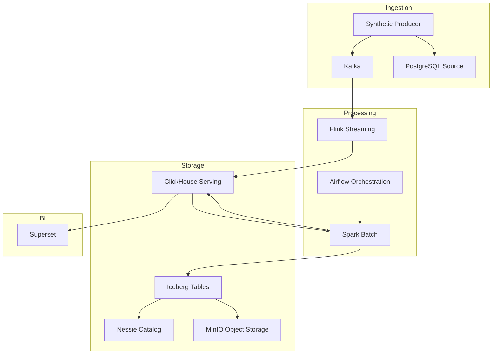
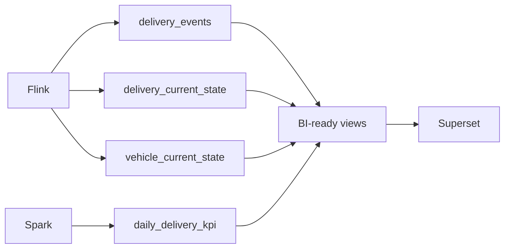
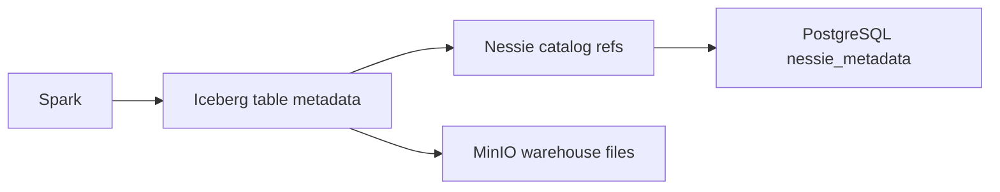
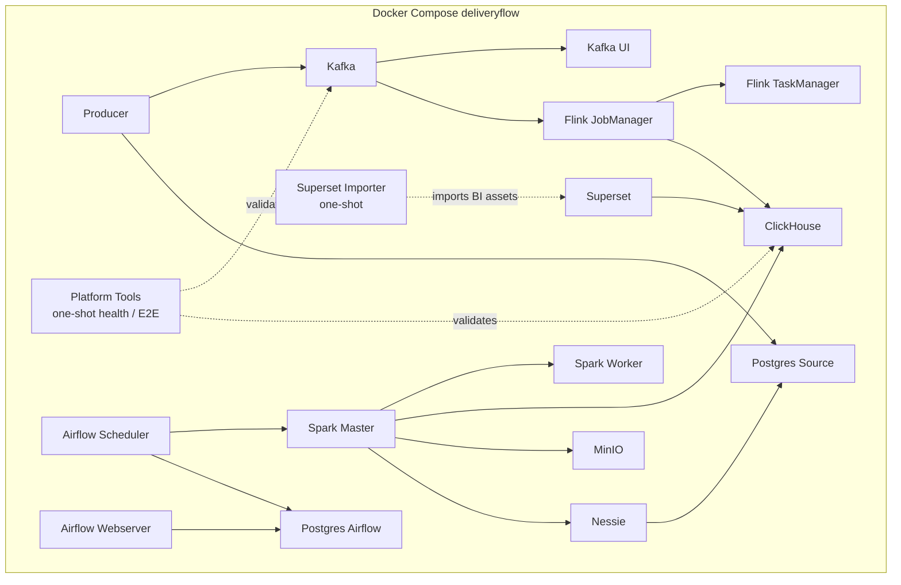

# Architecture Decisions

## ADR-000: Multi-Application Control Plane

DeliveryFlow is no longer documented as a single-application demo. The repository now has a small control-plane structure that separates application metadata, dataset metadata, and event contracts:

```text
configs/applications/
configs/datasets/
src/contracts/<domain>/
```

Decision:

- Keep the local platform simple, but make application ownership explicit.
- Keep delivery as the default application.
- Add fleet telemetry as an independent second application.
- Select non-default app runtime with `APP=fleet`.
- Keep Kafka topics domain-oriented, not one topic per table by default.
- Keep ClickHouse serving schemas domain-oriented: `delivery.*` and `fleet.*`.

The first implementation of this decision is `VehicleTelemetrySqlJob`, a Java Flink SQL/Table API job that reads `vehicle-telemetry-events` and writes to the `fleet` database. This is intentionally separate from `DeliveryStreamingJob`, which remains the Java DataStream implementation for delivery events.

This decision prepares the project for 300-500 table growth without requiring one Python script, one Spark job, one Flink job, one Airflow DAG, and one Superset file per table.

This document explains the main architecture decisions made for DeliveryFlow. The goal is to build a platform that is simple, functional, and aligned with data engineering principles for the local lab.

## High-Level Architecture



## Pinned Compatibility Set

These versions were selected for compatibility within the local platform:

- Kafka: `apache/kafka:3.9.2`
- Flink: `flink:1.20.3-scala_2.12-java11`
- Flink Kafka connector: `org.apache.flink:flink-connector-kafka:3.4.0-1.20`
- Spark base: `apache/spark:3.5.6-java17`
- Spark local image: `deliveryflow-spark:3.5.6`
- Iceberg Spark runtime: `org.apache.iceberg:iceberg-spark-runtime-3.5_2.12:1.11.0`
- Iceberg AWS bundle: `org.apache.iceberg:iceberg-aws-bundle:1.11.0`
- Nessie Spark extensions: `org.projectnessie.nessie-integrations:nessie-spark-extensions-3.5_2.12:0.105.3`
- Nessie server: `ghcr.io/projectnessie/nessie:0.107.5`
- Airflow: `apache/airflow:2.10.5-python3.10`
- Superset: `apache/superset:4.1.2`
- PostgreSQL: `postgres:16.4-bookworm`
- ClickHouse: `clickhouse/clickhouse-server:25.8`
- Object storage: `minio/minio:RELEASE.2025-04-22T22-12-26Z`

## ADR-001: Kafka KRaft Broker

Kafka runs as a single KRaft broker. ZooKeeper is not included in the local lab.

Rationale:

- Fewer services.
- Simpler local bootstrap.
- A setup closer to the modern Kafka deployment model.

Topic strategy:

```text
delivery-events
```

This topic carries delivery lifecycle events. The event key is `delivery_id`.

## ADR-002: Flink Stream Processing

Flink was selected for real-time event processing.

Rationale:

- Natural integration with Kafka as a source.
- Event-time and watermark support.
- Keyed stream processing.
- Checkpointing support.
- A suitable model for a real-time ClickHouse sink.

In this project, Flink:

- Consumes Kafka events.
- Parses JSON.
- Validates `schema_version = 1`.
- Builds delivery and vehicle state.
- Writes to ClickHouse.

## ADR-003: ClickHouse Serving Layer

ClickHouse is the operational and BI serving layer.

ClickHouse tables:

- `delivery.delivery_events`: immutable event history.
- `delivery.delivery_current_state`: latest delivery state.
- `delivery.vehicle_current_state`: latest vehicle state.
- `delivery.daily_delivery_kpi`: batch KPI serving table.

ClickHouse views:

- `v_delivery_status_overview`
- `v_delay_by_region`
- `v_vehicle_utilization`
- `v_warehouse_daily_kpi`
- `v_delivery_event_volume`



## ADR-004: Spark Batch Processing

Spark was selected for daily KPI and lakehouse writes.

Rationale:

- A broad ecosystem for batch aggregation.
- Iceberg integration.
- The ability to read from ClickHouse over JDBC.
- The ability to be controlled from Airflow with `spark-submit`.

Spark job:

```text
src/etl/apps/daily_kpi_job.py
```

Spark output:

- `nessie.bronze.raw_delivery_events`
- `nessie.gold.daily_delivery_kpi`
- `delivery.daily_delivery_kpi`

## ADR-005: Iceberg + Nessie + MinIO Lakehouse

The lakehouse layer has three parts:

- Iceberg table format.
- Nessie catalog.
- MinIO S3-compatible object storage.



Rationale:

- Iceberg provides the analytical table format.
- Nessie manages the catalog and versioned metadata.
- MinIO provides S3-compatible local object storage.

## ADR-006: PostgreSQL Database Separation

There are two PostgreSQL services:

- `postgres-airflow`
- `postgres-source`

`postgres-airflow` is used only for Airflow metadata.

`postgres-source` stores two databases:

- `logistics_source`
- `nessie_metadata`

This separation makes lifecycle and ownership clearer.

## ADR-007: Airflow Batch Orchestration

Airflow provides batch orchestration. It is not part of the streaming path.

Airflow responsibilities:

- Schedule DAGs.
- Check source readiness.
- Submit Spark jobs.
- Manage task status and retries.

In this project, Airflow uses `LocalExecutor`.

## ADR-008: Superset BI Layer

Superset is the BI and dashboard layer.

Superset connects to ClickHouse and builds charts from prepared views.

Rationale:

- Runs locally within Compose.
- Works with ClickHouse.
- Dashboards open in a browser.
- Keeps the platform fully local.

Superset should not use raw Kafka, raw MinIO, or Iceberg metadata. Its approved data source is the ClickHouse serving layer.

BI objects are not stored as manual UI configuration. `configs/superset/deliveryflow_bi.yaml` is the repository source of truth for Superset database, dataset, chart, and dashboard definitions.

The `make import-superset-assets` workflow applies these decisions:

- The `superset-importer` image is rebuilt first so YAML and Python importer changes are not left behind in an old image.
- YAML metric names are written as chart-level adhoc metrics rather than Superset saved metrics. This prevents `Metric 'event_count' does not exist` and `Metric 'delay_rate' does not exist` errors.
- `SUM(...)` is selected for count/sum columns, and `AVG(...)` for rate and average columns.
- Temporal metadata remains explicit for timeseries charts. `v_delivery_event_volume.event_hour` is the dataset `main_dttm_col` and temporal column, and is also the chart's `x_axis` and `granularity_sqla` value.
- `business_date` is recorded as a temporal column in the warehouse KPI dataset so future time-based charts follow the same rule.

The goal is for the Superset dashboard to import reproducibly into a clean environment: datasets, charts, and the dashboard should be created without metric or datetime metadata errors during chart rendering.

## ADR-009: One Generator, Two Data Types

The generator remains a single application:

```text
src/producers/synthetic_logistics_producer.py
```

It produces two data types:

- Batch source rows.
- Stream events.

Rationale:

- The same synthetic business domain is preserved.
- Batch and stream data remain logically consistent.
- No additional application complexity is introduced in the local lab.

## ADR-010: `make clean` and `make purge` Separation

`make clean` remains non-destructive:

```text
docker compose down --remove-orphans
```

`make purge` is for a destructive reset:

```text
docker compose down --volumes --remove-orphans --rmi local
```

Rationale:

- Normal cleanup must not remove data volumes.
- Schema changes need a separate, explicit target for a full reset.

## ADR-011: Producer and Platform Tooling Image Separation

Kafka broker infrastructure, the synthetic producer application, and operator tooling are kept in separate ownership boundaries:

```text
services/producer/Dockerfile
    -> producer
    -> producer-continuous

services/tooling/Dockerfile
    -> platform-tools health/E2E runner
    -> superset-importer
```

The producer image contains only `src/producers`, `kafka-python`, and `psycopg2-binary` for PostgreSQL batch seeding. The ClickHouse client, Requests, PyYAML, health/E2E scripts, and Superset assets remain in the one-shot tooling image.

This separation does not change existing Make targets or Compose service names. Its purpose is to separate the producer runtime from BI import and platform-diagnostics dependencies, reduce image rebuild coupling, and create a clear service boundary for future producer refactoring.

## ADR-012: Modular Producer and Stable Continuous Rate

The producer entrypoint is preserved as the operator interface, while the implementation is split into configuration, event generation, PostgreSQL source, and Kafka streaming modules. These boundaries separate event contracts from transport and deployment configuration, enable focused unit tests, and provide a dedicated configuration adapter point for future metadata-driven configuration.

The continuous producer has a default interval of 60 seconds and publishes a batch of 10 events per interval. The batch-of-10 model directly expresses the `T=00:00 -> 10 events`, `T=00:01 -> 10 events` semantics and keeps rate tests simple. The publisher uses monotonic fixed deadlines instead of a chain of relative `sleep(60)` calls, so serialization and Kafka flush time do not create cumulative rate drift. The existing `PRODUCER_CONTINUOUS_INTERVAL_SECONDS` environment override is retained for backward compatibility, while `PRODUCER_EVENTS_PER_INTERVAL` controls the record count per interval.

## Runtime Service Map



## Operational Rules

- Run `docker compose config --quiet` after runtime configuration changes.
- After schema changes, `make purge` may be required if an old volume remains.
- ClickHouse views should be the basis for dashboards.
- Batch jobs require source readiness; the KPI job may fail if ClickHouse `delivery_events` is empty.
- Submit the Flink job before starting the producer for streaming.
