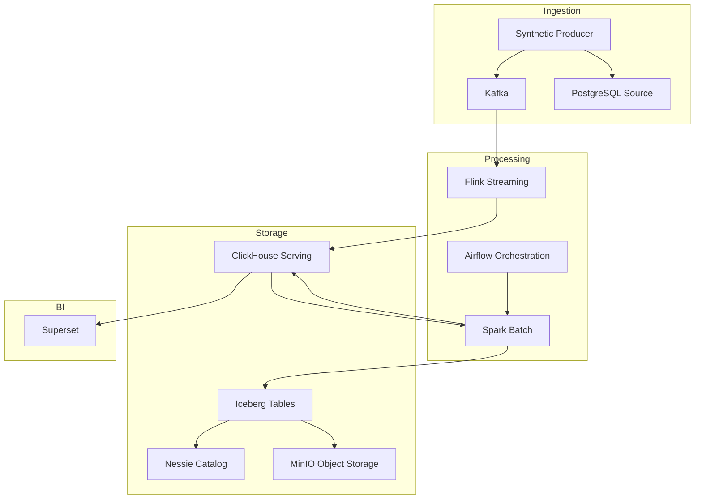
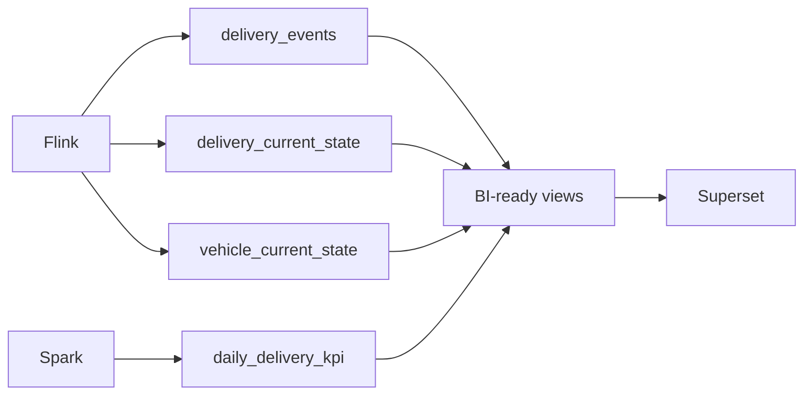
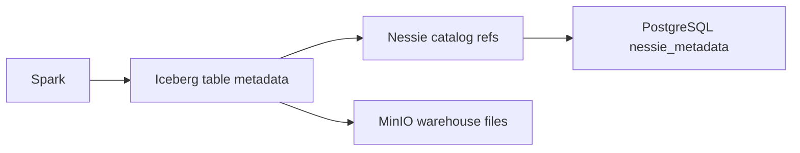
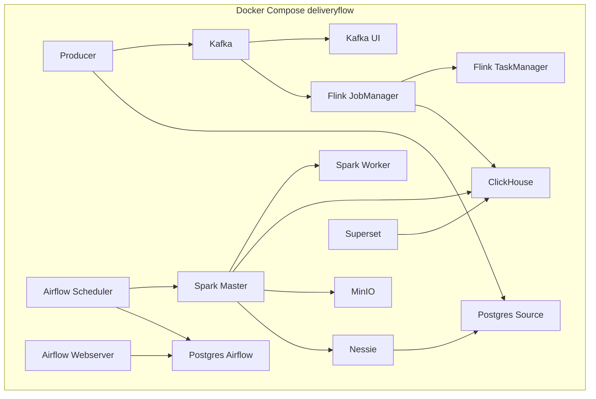

# Architecture Decisions

Bu sənəd DeliveryFlow layihəsində qəbul edilmiş əsas arxitektura qərarlarını izah edir. Qərarların məqsədi lokal lab üçün sadə, işlək və data engineering prinsiplərinə uyğun platforma qurmaqdır.

## Yüksək Səviyyəli Arxitektura



## Pinned Compatibility Set

Bu versiyalar lokal platformanın bir-biri ilə uyğun işləməsi üçün seçilib:

- Kafka: `apache/kafka:3.9.2`
- Flink: `flink:1.20.3-scala_2.12-java11`
- Flink Kafka connector: `org.apache.flink:flink-connector-kafka:3.4.0-1.20`
- Spark base: `apache/spark:3.5.6-java17`
- Spark local image: `deliveryflow-spark:3.5.6`
- Iceberg Spark runtime: `org.apache.iceberg:iceberg-spark-runtime-3.5_2.12:1.11.0`
- Iceberg AWS bundle: `org.apache.iceberg:iceberg-aws-bundle:1.11.0`
- Nessie Spark extensions: `org.projectnessie.nessie-integrations:nessie-spark-extensions-3.5_2.12:0.105.3`
- Nessie server: `ghcr.io/projectnessie/nessie:0.107.5`
- Airflow: `apache/airflow:2.10.5-python3.10`
- Superset: `apache/superset:4.1.2`
- PostgreSQL: `postgres:16.4-bookworm`
- ClickHouse: `clickhouse/clickhouse-server:25.8`
- Object storage: `minio/minio:RELEASE.2025-04-22T22-12-26Z`

## ADR-001: Kafka KRaft Broker

Kafka bir KRaft broker kimi işləyir. Lokal lab üçün ZooKeeper əlavə edilməyib.

Səbəb:

- Daha az servis.
- Daha sadə local bootstrap.
- Müasir Kafka deployment modelinə daha yaxın setup.

Topic strategiyası:

```text
delivery-events
```

Bu topic delivery lifecycle event-lərini daşıyır. Event key `delivery_id`-dir.

## ADR-002: Flink Stream Processing

Flink real-time event processing üçün seçilib.

Səbəb:

- Kafka source ilə təbii inteqrasiya.
- Event-time və watermark support-u.
- Keyed stream processing.
- Checkpointing support.
- Real-time ClickHouse sink üçün uyğun model.

Flink bu layihədə aşağıdakı işi görür:

- Kafka event-lərini consume edir.
- JSON parse edir.
- `schema_version = 1` yoxlayır.
- Delivery state və vehicle state hazırlayır.
- ClickHouse-a yazır.

## ADR-003: ClickHouse Serving Layer

ClickHouse operational və BI serving qatıdır.

ClickHouse cədvəlləri:

- `delivery.delivery_events`: immutable event history.
- `delivery.delivery_current_state`: latest delivery state.
- `delivery.vehicle_current_state`: latest vehicle state.
- `delivery.daily_delivery_kpi`: batch KPI serving table.

ClickHouse view-ları:

- `v_delivery_status_overview`
- `v_delay_by_region`
- `v_vehicle_utilization`
- `v_warehouse_daily_kpi`
- `v_delivery_event_volume`



## ADR-004: Spark Batch Processing

Spark daily KPI və lakehouse write üçün seçilib.

Səbəb:

- Batch aggregation üçün geniş ecosystem.
- Iceberg integration.
- JDBC ilə ClickHouse-dan oxuma imkanı.
- Airflow-dan `spark-submit` ilə idarə edilə bilməsi.

Spark job:

```text
src/etl/apps/daily_kpi_job.py
```

Spark output:

- `nessie.bronze.raw_delivery_events`
- `nessie.gold.daily_delivery_kpi`
- `delivery.daily_delivery_kpi`

## ADR-005: Iceberg + Nessie + MinIO Lakehouse

Lakehouse qatı üç hissədən ibarətdir:

- Iceberg table format.
- Nessie catalog.
- MinIO S3-compatible object storage.



Səbəb:

- Iceberg analytical table format verir.
- Nessie catalog və versioned metadata idarə edir.
- MinIO lokal object storage kimi S3-compatible davranır.

## ADR-006: PostgreSQL Database Separation

İki PostgreSQL servisi var:

- `postgres-airflow`
- `postgres-source`

`postgres-airflow` yalnız Airflow metadata üçündür.

`postgres-source` iki database saxlayır:

- `logistics_source`
- `nessie_metadata`

Bu ayrım lifecycle və ownership baxımından daha aydındır.

## ADR-007: Airflow Batch Orchestration

Airflow batch orchestration üçündür. Streaming path-a daxil deyil.

Airflow-un işi:

- DAG schedule etmək.
- Source readiness yoxlamaq.
- Spark job submit etmək.
- Task status və retry idarə etmək.

Bu layihədə Airflow `LocalExecutor` ilə işləyir.

## ADR-008: Superset BI Layer

Superset BI və dashboard qatıdır.

Superset ClickHouse-a qoşulur və prepared view-lardan chart qurur.

Səbəb:

- Compose daxilində lokal işləyir.
- ClickHouse ilə uyğundur.
- Dashboard-lar browser üzərindən açılır.
- Platforma tam lokal qalır.

Superset raw Kafka, raw MinIO və ya Iceberg metadata ilə işləməməlidir. Onun approved data source-u ClickHouse serving qatıdır.

## ADR-009: One Generator, Two Data Types

Generator tək app olaraq saxlanılıb:

```text
src/producers/synthetic_logistics_producer.py
```

Amma iki data tipi yaradır:

- Batch source rows.
- Stream events.

Bu qərarın səbəbi:

- Eyni synthetic business domain qorunur.
- Batch və stream data bir-biri ilə məntiqi uyğun qalır.
- Lokal lab-da əlavə app complexity yaranmır.

## ADR-010: `make clean` və `make purge` Ayrımı

`make clean` non-destructive qalır:

```text
docker compose down --remove-orphans
```

`make purge` destructive reset üçündür:

```text
docker compose down --volumes --remove-orphans --rmi local
```

Səbəb:

- Normal cleanup data volume-ları silməməlidir.
- Schema dəyişiklikləri zamanı tam sıfırlama üçün ayrıca açıq target lazımdır.

## Runtime Service Map



## Operasional Qaydalar

- Runtime config dəyişikliklərindən sonra `docker compose config --quiet` yoxlanmalıdır.
- Schema dəyişikliklərindən sonra köhnə volume varsa `make purge` tələb oluna bilər.
- Dashboard üçün ClickHouse view-ları əsas götürülməlidir.
- Batch job üçün source readiness lazımdır; ClickHouse `delivery_events` boşdursa KPI job fail edə bilər.
- Streaming üçün əvvəl Flink job submit edilməli, sonra producer işə salınmalıdır.
