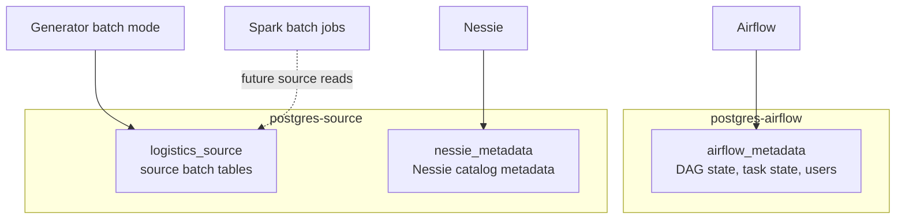
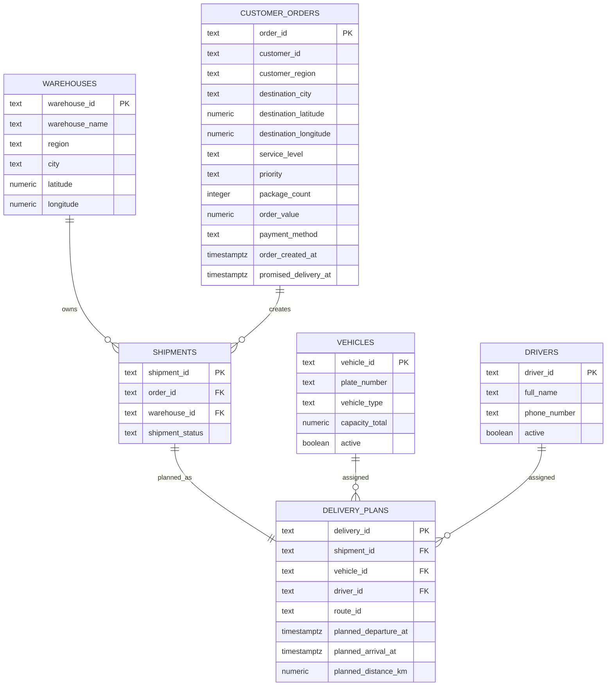
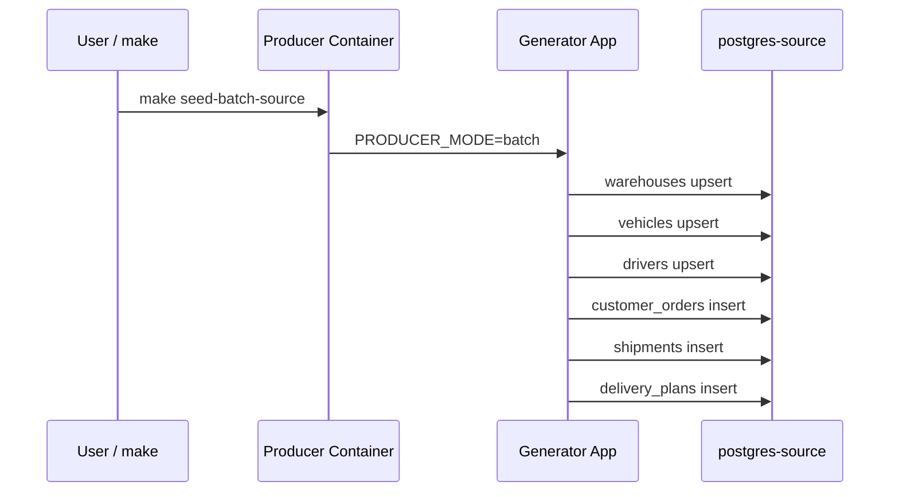
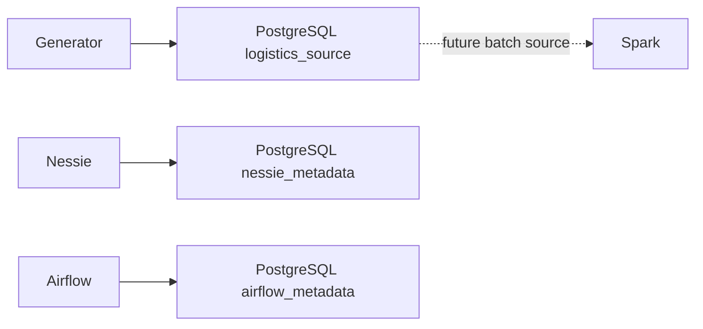

# PostgreSQL Source Tables

Bu sənəd DeliveryFlow layihəsində PostgreSQL source qatını izah edir. PostgreSQL burada iki fərqli məqsəd üçün istifadə olunur:

- Airflow metadata database.
- Logistics source və Nessie metadata database.

Əsas source data `postgres-source` servisindədir.

## PostgreSQL Servis Xəritəsi



## `postgres-source` Nə Üçündür?

`postgres-source` lokal source system kimi davranır. Real şirkətdə bu data ERP, OMS, WMS və ya TMS sistemlərindən gələ bilərdi. Bu layihədə həmin source sistemlər sadələşdirilib və PostgreSQL cədvəlləri ilə göstərilib.

Database:

```text
logistics_source
```

Init script:

```text
services/postgres/source-init/003_create_source_tables.sh
```

Generator batch mode bu cədvəlləri seed edir:

```powershell
make seed-batch-source
```

və ya default olaraq:

```powershell
make produce
```

## Entity Relationship Diagram



## Cədvəl 1: `warehouses`

Warehouse master data saxlayır.

Əsas field-lər:

- `warehouse_id`: warehouse üçün primary key.
- `warehouse_name`: insan oxuya bilən ad.
- `region`: regional grouping.
- `city`: şəhər.
- `latitude`, `longitude`: xəritə və location analytics üçün koordinatlar.
- `created_at`: record-un yaradılma vaxtı.

Bu cədvəl `shipments` ilə əlaqəlidir. Hər shipment bir warehouse-dan çıxır.

## Cədvəl 2: `vehicles`

Vehicle master data saxlayır.

Əsas field-lər:

- `vehicle_id`: vehicle üçün primary key.
- `plate_number`: unique nömrə.
- `vehicle_type`: məsələn, van və ya truck.
- `capacity_total`: daşıma capacity-si.
- `active`: vehicle istifadədədir ya yox.
- `created_at`: record-un yaradılma vaxtı.

Bu cədvəl `delivery_plans` ilə əlaqəlidir. Hər delivery plan bir vehicle-a assign olunur.

## Cədvəl 3: `drivers`

Driver master data saxlayır.

Əsas field-lər:

- `driver_id`: driver üçün primary key.
- `full_name`: driver adı.
- `phone_number`: əlaqə nömrəsi.
- `active`: driver aktivdir ya yox.
- `created_at`: record-un yaradılma vaxtı.

Bu cədvəl `delivery_plans` ilə əlaqəlidir. Hər delivery plan bir driver-a assign olunur.

## Cədvəl 4: `customer_orders`

Order-level source data saxlayır. Bu cədvəl batch analytics üçün ən zəngin source cədvəldir.

Əsas field-lər:

- `order_id`: order primary key.
- `customer_id`: customer identifikatoru.
- `customer_region`: customer regionu.
- `destination_city`: delivery destination şəhəri.
- `destination_latitude`, `destination_longitude`: delivery destination koordinatları.
- `service_level`: `standard`, `express`, `same_day` kimi service səviyyəsi.
- `priority`: `normal`, `high`, `critical` kimi prioritet.
- `package_count`: order içində package sayı.
- `order_value`: order monetary value.
- `payment_method`: ödəniş tipi.
- `order_created_at`: order yaradılma vaxtı.
- `promised_delivery_at`: promised delivery vaxtı.

Constraint:

- `promised_delivery_at > order_created_at`
- `package_count > 0`
- `order_value >= 0`

Bu cədvəl `shipments` üçün parent table-dır.

## Cədvəl 5: `shipments`

Order ilə warehouse arasında shipment əlaqəsi yaradır.

Əsas field-lər:

- `shipment_id`: shipment primary key.
- `order_id`: `customer_orders(order_id)` foreign key.
- `warehouse_id`: `warehouses(warehouse_id)` foreign key.
- `shipment_status`: shipment status.
- `created_at`: record yaradılma vaxtı.

Bu cədvəl order lifecycle üçün bridge rolundadır.

## Cədvəl 6: `delivery_plans`

Shipment-in necə daşınacağını göstərən plan cədvəlidir.

Əsas field-lər:

- `delivery_id`: delivery primary key.
- `shipment_id`: `shipments(shipment_id)` foreign key.
- `vehicle_id`: `vehicles(vehicle_id)` foreign key.
- `driver_id`: `drivers(driver_id)` foreign key.
- `route_id`: route identifikatoru.
- `planned_departure_at`: planlaşdırılmış çıxış vaxtı.
- `planned_arrival_at`: planlaşdırılmış çatma vaxtı.
- `planned_distance_km`: planlaşdırılmış məsafə.

Constraint:

- `planned_arrival_at > planned_departure_at`
- `planned_distance_km >= 0`

## Batch Source Seed Axını



Generator `ON CONFLICT DO NOTHING` istifadə edir. Bu o deməkdir ki, eyni ID ilə təkrar seed edəndə mövcud row-lar yenidən duplicate olmayacaq.

## Inspect Commands

Database-ləri görmək:

```powershell
docker compose exec postgres-source psql -U postgres -d postgres -c "\l"
```

`logistics_source` cədvəllərini görmək:

```powershell
docker compose exec postgres-source psql -U postgres -d logistics_source -c "\dt"
```

Bir cədvəlin strukturuna baxmaq:

```powershell
docker compose exec postgres-source psql -U postgres -d logistics_source -c "\d customer_orders"
```

Row saylarını yoxlamaq:

```powershell
docker compose exec postgres-source psql -U postgres -d logistics_source -c "SELECT count(*) FROM customer_orders;"
docker compose exec postgres-source psql -U postgres -d logistics_source -c "SELECT count(*) FROM delivery_plans;"
```

Source data sample:

```powershell
docker compose exec postgres-source psql -U postgres -d logistics_source -c "SELECT order_id, customer_region, service_level, priority, package_count, order_value FROM customer_orders LIMIT 10;"
```

Join sample:

```powershell
docker compose exec postgres-source psql -U postgres -d logistics_source -c "SELECT o.order_id, s.shipment_id, d.delivery_id, d.vehicle_id, d.driver_id FROM customer_orders o JOIN shipments s ON s.order_id = o.order_id JOIN delivery_plans d ON d.shipment_id = s.shipment_id LIMIT 10;"
```

## PostgreSQL və Digər Servislərin Əlaqəsi



## Vacib Qeydlər

- `postgres-source` içində həm source data, həm Nessie metadata var, amma bunlar ayrı database-lərdədir.
- `postgres-airflow` yalnız Airflow metadata üçündür.
- Source cədvəllər operational serving üçün deyil; serving ClickHouse-dadır.
- Superset PostgreSQL source cədvəllərini oxumamalıdır; dashboard üçün ClickHouse view-ları istifadə olunmalıdır.
- Köhnə volume qalarsa, init script-dəki yeni sütunlar mövcud cədvəllərə avtomatik əlavə olunmaya bilər. Belə halda lokal data-nı sıfırlamaq üçün `make purge` lazımdır.
