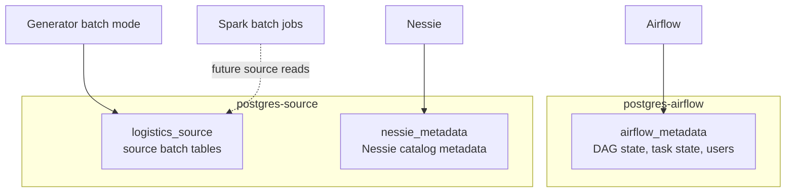
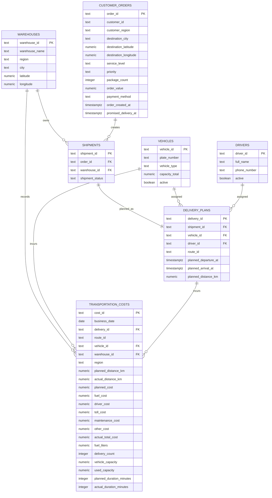
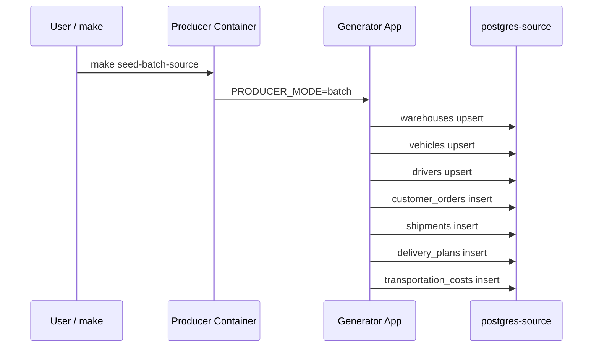
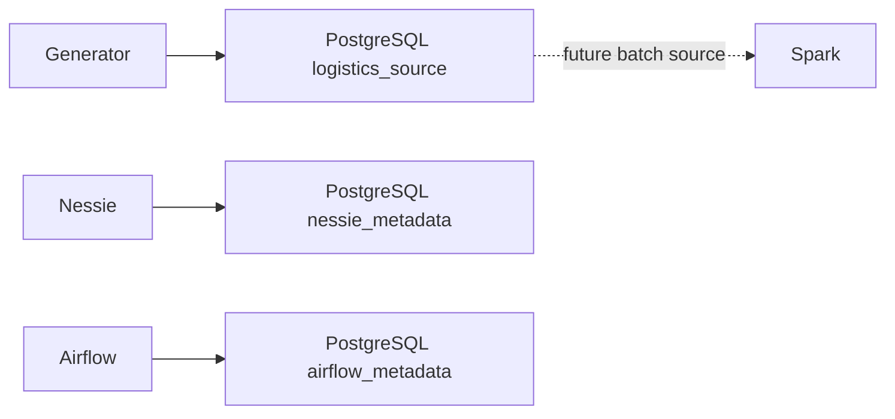

# PostgreSQL Source Tables

This document explains the PostgreSQL source layer in DeliveryFlow. PostgreSQL is used here for two different purposes:

- Airflow metadata database.
- The logistics source and Nessie metadata databases.

The primary source data is in the `postgres-source` service.

## PostgreSQL Service Map



## What Is `postgres-source` For?

`postgres-source` acts as the local source system. In a real company, this data could come from ERP, OMS, WMS, or TMS systems. In this project, those source systems are simplified and represented with PostgreSQL tables.

Database:

```text
logistics_source
```

Init script:

```text
services/postgres/source-init/003_create_source_tables.sh
```

The generator batch mode seeds these tables:

```powershell
make seed-batch-source
```

or, by default:

```powershell
make produce
```

## Entity Relationship Diagram



## Table 1: `warehouses`

Stores warehouse master data.

Main fields:

- `warehouse_id`: primary key for the warehouse.
- `warehouse_name`: human-readable name.
- `region`: regional grouping.
- `city`: city.
- `latitude`, `longitude`: coordinates for maps and location analytics.
- `created_at`: record creation time.

This table is related to `shipments`. Each shipment leaves one warehouse.

## Table 2: `vehicles`

Stores vehicle master data.

Main fields:

- `vehicle_id`: primary key for the vehicle.
- `plate_number`: unique number.
- `vehicle_type`: for example, van or truck.
- `capacity_total`: transport capacity.
- `active`: whether the vehicle is in use.
- `created_at`: record creation time.

This table is related to `delivery_plans`. Each delivery plan is assigned to one vehicle.

## Table 3: `drivers`

Stores driver master data.

Main fields:

- `driver_id`: primary key for the driver.
- `full_name`: driver's name.
- `phone_number`: contact number.
- `active`: whether the driver is active.
- `created_at`: record creation time.

This table is related to `delivery_plans`. Each delivery plan is assigned to one driver.

## Table 4: `customer_orders`

Stores order-level source data. This is the richest source table for batch analytics.

Main fields:

- `order_id`: order primary key.
- `customer_id`: customer identifier.
- `customer_region`: customer region.
- `destination_city`: delivery destination city.
- `destination_latitude`, `destination_longitude`: delivery destination coordinates.
- `service_level`: service level such as `standard`, `express`, or `same_day`.
- `priority`: priority such as `normal`, `high`, or `critical`.
- `package_count`: number of packages in the order.
- `order_value`: order monetary value.
- `payment_method`: payment type.
- `order_created_at`: order creation time.
- `promised_delivery_at`: promised delivery time.

Constraint:

- `promised_delivery_at > order_created_at`
- `package_count > 0`
- `order_value >= 0`

This table is the parent table for `shipments`.

## Table 5: `shipments`

Creates the shipment relationship between an order and a warehouse.

Main fields:

- `shipment_id`: shipment primary key.
- `order_id`: `customer_orders(order_id)` foreign key.
- `warehouse_id`: `warehouses(warehouse_id)` foreign key.
- `shipment_status`: shipment status.
- `created_at`: record creation time.

This table acts as the bridge for the order lifecycle.

## Table 6: `delivery_plans`

This planning table describes how a shipment will be transported.

Main fields:

- `delivery_id`: delivery primary key.
- `shipment_id`: `shipments(shipment_id)` foreign key.
- `vehicle_id`: `vehicles(vehicle_id)` foreign key.
- `driver_id`: `drivers(driver_id)` foreign key.
- `route_id`: route identifier.
- `planned_departure_at`: planned departure time.
- `planned_arrival_at`: planned arrival time.
- `planned_distance_km`: planned distance.

Constraint:

- `planned_arrival_at > planned_departure_at`
- `planned_distance_km >= 0`

## Table 7: `transportation_costs`

Stores route-level and trip-level operational cost facts for batch analytics (Dashboard 6).

Main fields:

- `cost_id`: primary key for the cost fact.
- `business_date`: business operating date for accounting partitioning.
- `delivery_id`: `delivery_plans(delivery_id)` foreign key linking cost facts to operational trips.
- `route_id`: route identifier.
- `vehicle_id`: `vehicles(vehicle_id)` foreign key.
- `warehouse_id`: `warehouses(warehouse_id)` foreign key.
- `region`: delivery geographic region.
- `planned_distance_km`, `actual_distance_km`: estimated vs actual logged GPS distance.
- `planned_cost`: baseline budgeted trip cost.
- `fuel_cost`, `driver_cost`, `toll_cost`, `maintenance_cost`, `other_cost`: discrete cost components.
- `actual_total_cost`: total incurred cost.
- `fuel_liters`: diesel/fuel volume consumed.
- `delivery_count`: total completed customer drop-offs on route.
- `vehicle_capacity`, `used_capacity`: rated payload capacity vs actual load carried.
- `planned_duration_minutes`, `actual_duration_minutes`: estimated vs actual trip duration.

Constraints & Integrity Rules:

- `cost_id` is the primary key.
- All distance, cost, volume, count, capacity, and duration values must be non-negative (`>= 0`).
- `vehicle_capacity > 0`.
- `used_capacity <= vehicle_capacity` (capacity overload prevention).
- `actual_total_cost = fuel_cost + driver_cost + toll_cost + maintenance_cost + other_cost` (exact financial reconciliation check).

## Batch Source Seed Flow



The generator uses `ON CONFLICT DO NOTHING`. This means reseeding with the same IDs does not duplicate existing rows.

## Inspect Commands

To list databases:

```powershell
docker compose exec postgres-source psql -U postgres -d postgres -c "\l"
```

To list `logistics_source` tables:

```powershell
docker compose exec postgres-source psql -U postgres -d logistics_source -c "\dt"
```

To inspect a table structure:

```powershell
docker compose exec postgres-source psql -U postgres -d logistics_source -c "\d customer_orders"
```

To check row counts:

```powershell
docker compose exec postgres-source psql -U postgres -d logistics_source -c "SELECT count(*) FROM customer_orders;"
docker compose exec postgres-source psql -U postgres -d logistics_source -c "SELECT count(*) FROM delivery_plans;"
```

Source data sample:

```powershell
docker compose exec postgres-source psql -U postgres -d logistics_source -c "SELECT order_id, customer_region, service_level, priority, package_count, order_value FROM customer_orders LIMIT 10;"
```

Join sample:

```powershell
docker compose exec postgres-source psql -U postgres -d logistics_source -c "SELECT o.order_id, s.shipment_id, d.delivery_id, d.vehicle_id, d.driver_id FROM customer_orders o JOIN shipments s ON s.order_id = o.order_id JOIN delivery_plans d ON d.shipment_id = s.shipment_id LIMIT 10;"
```

## PostgreSQL and Other Services



## Important Notes

- `postgres-source` contains both source data and Nessie metadata, but they are in separate databases.
- `postgres-airflow` is used only for Airflow metadata.
- Source tables are not for operational serving; ClickHouse provides serving.
- Superset should not read PostgreSQL source tables; dashboards should use ClickHouse views.
- If an old volume remains, new columns in the init script may not be added automatically to existing tables. In that case, use `make purge` to reset local data.
